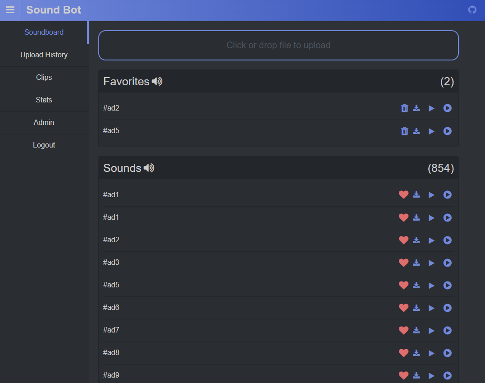

# Discord Sound Bot

A soundboard bot for discord. Build with Go/React.



## How to use

- [Download latest release here](https://github.com/mgerb/go-discord-bot/releases)
- Install [youtube-dl](https://github.com/rg3/youtube-dl/blob/master/README.md#installation)
- Install [ffmpeg](https://www.ffmpeg.org/download.html)
- edit your config.json file
- run the executable
- visit http://localhost:8080

### With docker-compose

Make sure to create a `config.json` file in your data volume.
Take a look at `config.template.json` for example configurations.

docker-compose.yml

```
version: "3"

services:
  go-discord-bot:
    image: mgerb/go-discord-bot:latest
    restart: unless-stopped
    ports:
      - 8088:8080
    volumes:
      - <path to your data directory>:/bot
      - /usr/local/bin/youtube-dl:/usr/bin/youtube-dl
```

#### Running Bot Scripts

Use the following scripts

- restore-messages
  - used to search message history and store in database
- update-db
  - used to run additional DB change scripts (will likely never have to be run)

Example:

```
docker-compose exec go-discord-bot /server/bot-scripts update-db
docker-compose exec go-discord-bot /server/bot-scripts restore-message <roomID>
```

### Commands

- `clip` - clips the past minute of audio (currently bugged if more than one user is speaking)
- `summon` - summons the bot to your current channel
- `dismiss` - dismisses the bot from the server
- `<audio clip>` - play a named audio clip
- `random` - play a random audio clip

### Uploading files

Discord oauth is used to authenticate users in order to upload files.
To get oauth working you must set up your bot client secret/id in the config.
You must also set up the redirect URI. This is needed so discord can redirect
back to your site after authentication. Discord doesn't like insecure redirects
so you will have to use a proxy for this. I prefer using [caddy](https://github.com/mholt/caddy)
with the following config.

```
https://localhost {
  tls self_signed
  proxy / http://localhost:8080 {
    transparent
  }
}
```

For public hosting you will want to use something like this.

```
https://<your domain name> {
  tls <your email>
  proxy / http://localhost:8080 {
    transparent
  }
}
```

### Stats

If logging is enabled the bot will log all messages and store in a database file. Currently the bot keeps track of
all messages that contain links in them. I added this because it's something we use in my discord.
Check it out in the "Stats" page on the site.

## Building from Source

### Dependencies

- Go (1.10+)
- node/npm (node 8)
- make

### Compiling

- Install dependencies
  - packr - `go get -u github.com/gobuffalo/packr/...`
  - [dep](https://github.com/golang/dep) - `go get -u github.com/golang/dep/cmd/dep`
- Rename the `config.template.json` to `config.json`
- add configurations to `config.json`
- run `make all`
- open a browser `localhost:<config_port>`

[Packr](https://github.com/gobuffalo/packr) is used to bundle the static web assets into the binary.
Use these commands to compile the project. The client must be built first.
